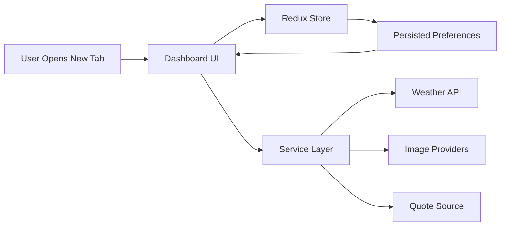

# Chrome Extension Dashboard UI

<p align="center">
  <strong>Premium Chrome New Tab Experience</strong>
  <br />
  Weather intelligence, task planning, daily inspiration, and visual personalization in one modern dashboard.
</p>

<p align="center">
  
  
  
  
  
  
</p>

<p align="center">
  <a href="#quick-start">Quick Start</a> |
  <a href="#chrome-extension-workflow">Load as Extension</a> |
  <a href="#commands">Commands</a> |
  <a href="#marketing-copy">Marketing Copy</a>
</p>

## Overview

This project replaces the default Chrome new tab with a polished productivity dashboard. It is designed to deliver immediate day-start clarity by combining weather, todos, quotes, and background customization into a single focused workspace.

## At a Glance

| Category        | What You Get                                            |
| --------------- | ------------------------------------------------------- |
| Productivity    | Todo tracking with persistent state                     |
| Context         | Real-time weather by city or current location           |
| Motivation      | Inspirational quote section                             |
| Personalization | Dynamic backgrounds via Unsplash, Pexels, or custom URL |
| Platform        | Manifest V3-ready Chrome extension workflow             |

## Table of Contents

- [Why It Feels Premium](#why-it-feels-premium)
- [Feature Highlights](#feature-highlights)
- [Architecture Flow](#architecture-flow)
- [Tech Stack](#tech-stack)
- [Quick Start](#quick-start)
- [Environment Variables](#environment-variables)
- [Commands](#commands)
- [Chrome Extension Workflow](#chrome-extension-workflow)
- [Project Structure](#project-structure)
- [Deployment Notes](#deployment-notes)
- [Troubleshooting](#troubleshooting)
- [Marketing Copy](#marketing-copy)
- [License](#license)

## Why It Feels Premium

- Strong visual hierarchy with clean component-based layout
- Smart defaults that keep users productive with minimal setup
- Personalization controls that do not compromise performance or simplicity

## Feature Highlights

### Productivity Core

- Todo list with persistent state management
- Fast interactions and lightweight daily planning flow

### Live Context

- Weather widget with city search and geolocation support
- Daily quote section to keep the experience fresh and engaging

### Personalization Layer

- Background provider switching (Unsplash, Pexels, custom image URL)
- Settings modal for theme and behavior controls

## Architecture Flow



## Tech Stack

- Next.js 16 (App Router)
- React 19
- TypeScript
- Redux Toolkit + React Redux + redux-persist
- Tailwind CSS 4
- Radix UI primitives

## Quick Start

### Prerequisites

- Node.js 20+
- pnpm 10+

### 1. Install Dependencies

```bash
pnpm install
```

### 2. Configure Environment

Create `.env.local` in the project root:

```bash
NEXT_PUBLIC_WEATHER_API_KEY=your_openweather_key
NEXT_PUBLIC_WEATHER_BASE_URL=https://api.openweathermap.org/data/2.5

NEXT_PUBLIC_UNSPLASH_ACCESS_KEY=your_unsplash_access_key
NEXT_PUBLIC_PEXELS_API_KEY=your_pexels_api_key
```

### 3. Run Development Server

```bash
pnpm dev
```

App URL: `http://localhost:5000`

## Environment Variables

| Variable                          | Purpose                          | Required              |
| --------------------------------- | -------------------------------- | --------------------- |
| `NEXT_PUBLIC_WEATHER_API_KEY`     | OpenWeather API key              | Yes (weather feature) |
| `NEXT_PUBLIC_WEATHER_BASE_URL`    | Weather API base URL             | No                    |
| `NEXT_PUBLIC_UNSPLASH_ACCESS_KEY` | Unsplash API key                 | Optional              |
| `NEXT_PUBLIC_PEXELS_API_KEY`      | Pexels API key                   | Optional              |
| `WEATHER_KEY`                     | Server-side weather fallback key | Optional              |
| `WEATHER_BASE_URL`                | Server-side weather fallback URL | Optional              |

Recommendation: configure weather plus at least one background provider key.

## Commands

| Command                | Description                           |
| ---------------------- | ------------------------------------- |
| `pnpm dev`             | Start local dev server on port 5000   |
| `pnpm build`           | Create production build               |
| `pnpm start`           | Run production server                 |
| `pnpm start:fresh`     | Rebuild and run production server     |
| `pnpm build:static`    | Build static-ready app                |
| `pnpm extension:build` | Build extension-ready output in `out` |
| `pnpm extension:zip`   | Create `release/chrome-extension.zip` |

## Chrome Extension Workflow

### Load Unpacked Extension

1. Build extension output:

```bash
pnpm run extension:build
```

2. Open `chrome://extensions`
3. Enable Developer mode
4. Click `Load unpacked`
5. Select the `out` folder

This project uses Manifest V3 via `public/manifest.json` and overrides the new tab page.

### Create Zip Package

```bash
pnpm run extension:zip
```

Generated artifact: `release/chrome-extension.zip`

## Project Structure

```text
src/
  app/          App Router pages, layout, globals
  components/   Dashboard features and reusable UI
  services/     API clients, config, and hooks
  store/        Redux provider, store, slices
public/         Static assets and extension manifest
scripts/        Extension build and packaging scripts
docs/           Reusable project description and marketing copy
```

## Deployment Notes

For production web build:

```bash
pnpm build
pnpm start
```

If stale output appears:

```bash
pnpm run start:fresh
```

## Troubleshooting

### Module Resolution Errors

- Run `pnpm install`
- Ensure imports do not include pinned package versions in source paths

### Weather Data Not Loading

- Verify `NEXT_PUBLIC_WEATHER_API_KEY`
- Allow browser location access when using current-location weather

### Extension Not Appearing in Chrome

- Confirm `public/manifest.json` is valid
- Rebuild with `pnpm run extension:build`
- Reload `out` from `chrome://extensions`

## Marketing Copy

Need store, recruiter, and SaaS-ready descriptions?

Use `docs/project-descriptions.md` for:

- Chrome Web Store listing copy
- Enterprise and SEO-focused variants
- GitHub About and topics
- Recruiter and portfolio descriptions

## License

No explicit license file is currently included. Add a license before public distribution.
